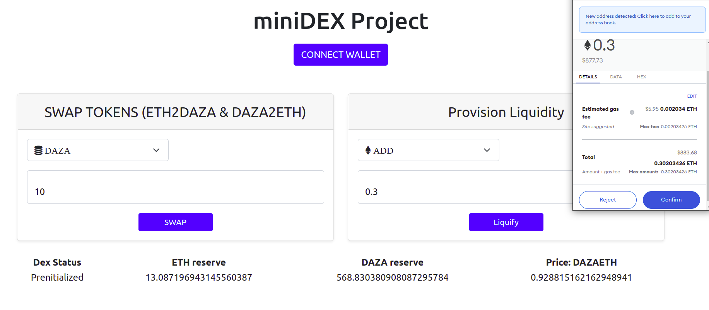

# DAZA: Decentralized Afro-Zoned Addresses.

<br>

## Author: Irikefe Aniboh

## Introduction:

- Although a far cry from the original goal DAZA aims to promote the utilizes of Cryptocurrencies across Africa using established decentralized retail banking model. 

- This models empowers decentralized actors to acts a Fiat to Cryptocurrency ramp whilst provisioning liquidity for all related transactions.

- For the context of this bootcamp DAZA explores the basic functionalities of a Decentralized Exchange using Smart Contracts.

- The current Smart Contracts allows users to swap between the Exchange's native token DAZA and ETH whilst adding and removing liquidity from the exchange's pool.

- These functionalitiies are trivial compared to existing AMMs but future work would leverage established AMMs like TinyMAN and dAMM to route token swaps and provision liquidity.

- This miniDEX is preinitialized with 1ETH and 100DAZA tokens and the token pair price is calculated per DEX action.

- DAZA is the exchange's native token created using Openzeppelin's ERC20 contract library.


<br>
<p align="center"> 
  
</p>

## Future Work:
-  Swap routing using dAMM to access both Layer 1 and Layer 2 liquidity pools consecutively.
- Modern UI update using NEXT.js.
- Incorporation of a decentralize on and off ramp for fiat.

## Application Flow:

- User visits the https://dazav1.herokuapp.com/ having some test ETH balance on the ropsten network.
- User then connects wallet to the exchange and automatically gets credited with 300 DAZA tokens.
- User gets a UI update of the existing state of the exchange's liquidity pool.
- User can then experiment with the exchange's swap function where you can swap between DAZA and ETH.
- User enters swap amount and is debited the swap amount of tokens and credited the swapped token.
- This action updates the UI with the current exchange's liquidity pool and the native token price based off this.
- User can also choose to add more liquidity to the pool or remove some liquidity from the exchange's pool.


## Deployed version on Ropsten Ethereum testnet
https://dazav1.herokuapp.com/

## Directory Structure

| Folder     | Content                           |
| ---------- | --------------------------------- |
| Client     | React front-end                   |
| Contracts  | Solidity smartcontracts           |
| Migrations | Scripts to deploy smartcontracts  |
| Test       | Smartcontract tests in Javascript |

## Installation instructions:

### Local blockchain using Ganache:

#### Prerequisites
- Node.js v8.9.4 or later
- NPM v5.0.3 or later
- Windows, Linux or Mac OS X
- MetaMask extension in browser
- Ganache-cli or another local testnet on port 7585

- Startup Ganache-cli


### IMPORTANT !! 
import a wallet address using a privateKey that isn't the first address/deployment address for Ganache-cli.
- 

```bash
$ git clone https://github.com/Tirikefe41/blockchain-developer-bootcamp-final-project.git
$ cd blockchain-developer-bootcamp-final-project
$ npm install
$ truffle migrate --reset
```
- locate abiCA.js under /public/js
- Change dazaTokenCA and dazaDEXca to corresponding contract addresses.
- Change the deployprivateKey to the first privateKey in ganache-cli or set the deploy account.
- Run /public/index.html as a liveServer.
- You can now interact with the contract using your metamask wallet.


## Screencast link
https://youtu.be/ka6acOQTWIw

## Public Ethereum wallet for certification
0x1661dc4bc22a97b0a4b94f03cbea4bac76018e5f